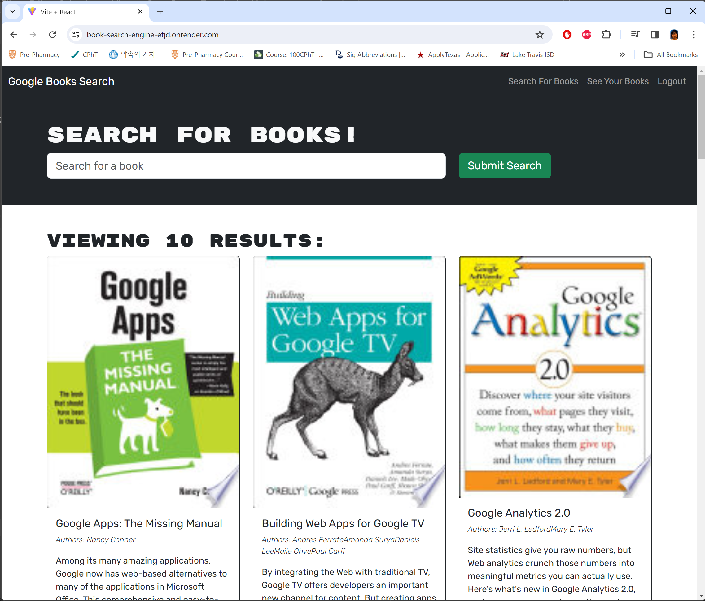

# Book Search Engine  

## Description

This program provides a reader with a functionality to search for new books to read so that the reader can keep a list of books to purchase.

## Features

GIVEN a book search engine

* WHEN you load the search engine, THEN you are presented with a menu with the options Search for Books and Login/Signup and an input field to search for Books and Login/Signup and an input field to search for books and a submit button

* WHEN you click on the Search for Books menu option, THEN you are presented with an input field to search for books and a submit button

* WHEN you are not logged in and enter a search term in the input field and click the submit button, THEN you are presented with several search results, each featuring a book's title, author, description, image, and a link to that book on the Google Books site

* WHEN you click on the Login/Signup menu option, THEN a modal appears on the screen with a toggle between the option to log in or sign up

* WHEN the toggle is set to Signup, THEN you are presented with three inputs for a username, an email address, and a pasword, and a signup button

* WHEN the toggle is set to Login, THEN you are presented with two inputs for an email address and a pasword and login button

* WHEN you enter a valid email address and create a password and click on the signup button, THEN your user account is created and you are logged in to the site.

* WHEN you enter your account's email address and password and click on the login button, THEN the modal closes and you are logged in to the site.

* WHEN you are logged in to the site, THEN the menu options change to Search for Books, an option to see your saved books, and Logout

* WHEN you are logged in and enter a search term in the input field and click the submit button, THEN you are presented with several search results, each featuring a book's title, author, description, image, and a link to that book on the Google Books site and a button to save a book to my account

* WHEN I click on the Save button on a book, THEN that book's information is saved to my account

* WHEN I click on the option to see my saved books, THEN I am presented with all of the books I have saved to my account, each featuring the book's title, author, description, image, and a link to that book on the Google Books site and a button to remove a book from my account.

* WHEN I click on the Remove button on a book, THEN that book is deleted from my saved books list

* WHEN I click on the Logout button, THEN I am logged out of the site and presented with a menu with the options Search for Books and Login/Signup and an input field to search for books and a submit button

## Source Code References
  This project has used some reference codes from the following sites

   * https://git.bootcampcontent.com/University-of-Texas-at-Austin/UTA-VIRT-FSF-PT-07-2023-U-LOLC.git   

## Contact
  * Author: Kyosook Shin
  * Author's Email: kyosook.shin@gmail.com  
  * GitHub: https://github.com/alla0810/book-search-engine
  * Render deployment: https://book-search-engine-etjd.onrender.com/

## Screenshot  

  
